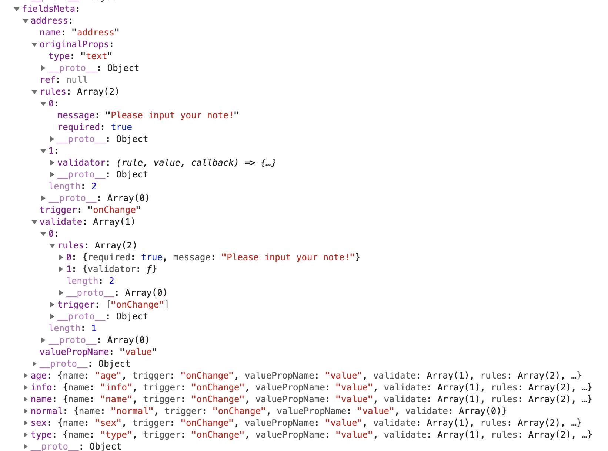

#  Rc-Form源码分析

大家好，欢迎同学们和我一起来学习Rc-Form源码分析， Rc-Form其实就是阿里ant design form的底层源码，今天我们来学习下Rc-Form源码分析，学习完以后我们在使用ant design form 会更加游刃有余。


 


Rc-Form功能： 主要是用来 创建和收集字段的数据和校验字段错误信息，让开发程序员少代码能实现这一的功能。

* 接下来我们来一起看看Rc-Form整个代码构思，Rc-Form 主要分为几个模块 createBaseForm 的 getForm 向整个组件props注入 setFieldsValue, getFieldsValue,resetFields,validateFields ，getFieldDecorator， getFieldProps。
* createFieldsStore 是用来存储字段fields  value 和 error 和 方法。里面用到了 订阅和发布模式。类似于redux的一个东西


## Rc-Form文件分析

接下来我们细说整个代码。

首先我们需要把这个code下载下来。第一步安装node_modules

```
npm i --save rc-form
```

这样就可以把rc-form源码下载下来了，

然后我们最好启动一个react项目，当然我们可以使用react-create-app创建一个react项目。

然后把rc-form源码包源码最好拷贝到react项目中的scr 目录中，这样后期我们在rc-form插件中写上注释还可以保留。

下载下来之后_rc-form@2.4.11@rc-form 包会有几个文件夹目录。一般webpack 默认引用的的是es包。


```
 outputpath
├── dist  # umd module 
     UMD（Universal Module Definition）是 AMD 和 CommonJS 的糅合，跨平台的解决方案
     UMD 打包出来的文件可以直接通过 script 插件 html 中使用
 ;(function(root, factory) {
  if (typeof exports === 'object' && typeof module === 'object')
    module.exports = factory()
  else if (typeof define === 'function' && define.amd) define([], factory)
  else if (typeof exports === 'object') exports['A'] = factory()
  else root['A'] = factory()
})(window, function() {
  //...
})
    
├── es    # es module
ES Module 不是对象，是使用 export 显示指定输出，再通过 import 输入。此法为编译时加载，编译时遇到 import 就会生成一个只读引用。等到运行时就会根据此引用去被加载的模块取值。所以不会加载模块所有方法，仅取所需。
export const m = 1
export {
  m
}


├── lib   # commonjs module
   CommonJS 模块是对象，是运行时加载，运行时才把模块挂载在 exports 之上（加载整个模块的所有），加载模块其实就是查找对象属性。
  导出使用 module.exports，也可以 exports。就是在此对象上挂属性。exports 指向 module.exports，即 exports= module.exports
  
 加载模块通过 require 关键字引用
  module.exports.add = function add() {
  return
}
exports.sub = function sub() {
  return
}

const a = require('a.js')

```


如果你喜欢 当然 也可以直接看 cdn 包。


接下来我们来看文件

### createBaseForm.js

#### 这个js主要用于创造基本的 form 组件

他的实现主要利用了react 的 hoc 高级组件方式实现，原理其实就是返回一个匿名函数然后在函数中传递一个子组件进来，然后利用 hoc 高阶组件  把props的form 注入进来给children组件，实现例子,这里用到以前的一些知识点 比如闭包，函数式编程，函数式柯里化。所以下面我们来简单的实现一个props.form 注入 子组件中

```
 // 因为第一层需要传递参数
const createForm = (options) => {
  return (Component) => {
    return class Form extends React.Component {
      getForm() {
        return {
          getFieldsValue: () => {}, // 获取字段值得函数
          getFieldValue: () => {}, // 获取单个值得函数
          getFieldInstance: () => {}, // 获取字段实例
          setFieldsValue: () => {}, // 设置字段值
          setFields: () => {}, // 设置字段 新的值
          setFieldsInitialValue: () => {}, // 设置初始化值的函数
          getFieldDecorator: () => {}, // 用于和表单进行双向绑定，详见下方描述 装饰组件，促进双向绑定的修饰器
          getFieldProps: () => {}, // 创建待验证的表单 设置字段元数据，返回 计算被修饰组件的属性
          getFieldsError: () => {}, //获取一组输入控件的 Error ，如不传入参数，则获取全部组件的 Error
          getFieldError: () => {}, //获取某个输入控件的 Error
          isFieldValidating: () => {}, //判断一个输入控件是否在校验状态
          isFieldsValidating: () => {}, // 判断字段是否在校验中
          isFieldsTouched: () => {}, //判断是否任一输入控件经历过 getFieldDecorator 的值收集时机 options.trigger
          isFieldTouched: () => {}, //判断一个输入控件是否经历过 getFieldDecorator 的值收集时机 options.trigger
          isSubmitting: () => {}, // 是否在 提交状态
          submit: () => {}, // 表单提交函数
          validateFields: () => {}, //验证字段,返回promise
          resetFields: () => {}, // 重置字段
        };
      }
      render() {
        const props = {
          form: this.getForm.call(this),
        };
        return <Component {...props} />;
      }
    };
  };
};

class BaseForm extends React.Component {
  constructor(props) {
    super(props);
  }

  componentDidMount() {
    console.log(this.props);
    debugger;
  }
  render() {
    return (
      <form>
        <input />
        <select>
          <option>1</option>
        </select>
      </form>
    );
  }
}

const Form = createForm({ name: "abc" })(BaseForm);

ReactDOM.render(<Form />, document.getElementById("example"));
```

#### 连接createFieldsStore类的各种方法

* props的form上的方法大多数是调用createFieldsStore类的方法，通过调用createFieldsStore 的各种方法实现控制字段的增删改查。  

## createFieldsStore.js 

* createFieldsStore 可以理解是用于存储字段信息值，包括字段值和校验，错误信息 还有 事件等。可以理解成仓库比如像redux这种。然后这个类会有各种方法包括增删改查字段，校验字段等。

  * 数据格式：

    * 每创建一个form 表单（ 比如 createForm()(RcForm) ） 就会实例化createFieldsStore 一次，同时该createFieldsStore 就会产生一个实例属性fields和一个实例属性fieldsMeta

    * fields 是validateFields 调用回调函数之后，传递给用户的field值，用来记录用户输入值的对象。  数据格式为字段名称作为key， 里面 是对象value值 :  

      ```
       {
        fieldName:{
          value: "1"
        }
       }
      ```

    * fieldsMeta数据 ，该数据作用是为RcForm存储操作记录使用的， 数据格式为字段名称作为key代表的是哪个字段的，然后后面是对象，对象里面存放着字段的事件，校验，初始化值，属性等。



* fieldsMeta 新增，获取和删除方法
  * getFieldMeta  //  获取单个字段的getFieldMeta 对象，如果没有则为 新增 一个空对象
  * setFieldMeta // 设置 fieldsMeta 字段信息  
  * clearField   // 清除Field和Meta字段
* fields的设置和删除字段和获取值方法，
  * setFields // 设置字段 新的值
  * clearField   // 清除Field和Meta字段
  * resetFields // 重置value
  * getValueFromFields // 获取字段的value值 
  * getFieldValuePropValue    // 获取字段的value 值
  * getFieldsValue // 获取字段的值
  * getAllValues // 获取全部字段的值
  * getAllFieldsName //获取全部字段名称
  * getFieldsError // 获取字段错误信息


## createFormField.js

* 该类是为每一个字段创建一个对象用来存储该字段的数据

* 其实该类初始化并没有做什么，可以用一个单列模式去写就可以了。

  

## 创建Form程序流程

* 一开始会调用 createBaseForm，进行 初始化 form表单一些参数比如

```
createBaseForm(options)(Component) 
//options 为整个表单配置的参数
// Component 表单组件 为改组件注入props.form


createBaseForm 组件的 getInitialState 
创建 初始化 fieldsStore 

```


#### getFieldDecorator  

*  // 用于和表单进行双向绑定，详见下方描述 装饰组件，促进双向绑定的修饰器
* 实际上他主要也是调用getFieldProps 方法， 
* 通过闭包，hoc高阶组建，利用React.cloneElement 隐形 把 props 的value和onChange注入 到组建中
* 以下片段代码

```
    // 用于和表单进行双向绑定，详见下方描述 装饰组件，促进双向绑定的修饰器
      getFieldDecorator: function getFieldDecorator(
        name, // 字段名称
        fieldOption // 字段设置参数
      ) {
        var _this2 = this;
        // 创建待验证的表单 设置字段元数据，返回 计算被修饰组件的属性
        var props = this.getFieldProps(name, fieldOption);
        return function (
          fieldElem // 组件 也可以理解为react 的 vnode 虚拟dom
        ) {
        // .....
        return React.cloneElement(
            fieldElem, //原来的vnode
            // props 属性
            _extends(
              {},
              props, // 用户传进来的 props 属性
              // 获取value 属性值
              _this2.fieldsStore.getFieldValuePropValue(fieldMeta)
            )
          );
        
        .....
        
```


#### getFieldProps 

- 该方法主要是返回 onChange 方法和 value 让组件变成受控组件，促进双向绑定的修饰器。
- 调用trigger (onCollectValidate)和validateTriggers方法(onCollect)
- 为Meta 类添加一个 MetaFiel 对象
- 

```
 // 获取单个字段的getFieldMeta 对象 这个是字段 信息 和设置 Meta 初始化值作用
 // 
var fieldMeta = this.fieldsStore.getFieldMeta(name);
     //获取字段选项参数
        var fieldOption = _extends(
          {
            name: name, // 字段名称
            trigger: DEFAULT_TRIGGER, //onChange 收集子节点的值的时机
            valuePropName: "value", // 字段value
            validate: [], // 验证 空数组
          },
          usersFieldOption //  字段选项参数
        );
         /// ... 省略代码
        
         return inputProps;

```


#### normalizeValidateRules 获取字段验证规则

```
/*
 获取收集字段验证规则，并添加到队列中
*/
function normalizeValidateRules(
   validate,  // 收集验证规则字段存储
   rules,  // 字段验证规则
   validateTrigger // 触发字段验证规则事件数组
   ) {

  var validateRules = validate.map(function (item) {
    var newItem = _extends({}, item, {
      trigger: item.trigger || [],
    });
    if (typeof newItem.trigger === "string") {
      newItem.trigger = [newItem.trigger];
    }
    return newItem;
  });
  console.log("validateRules=", validateRules);
  // 如果该字段有验证规则泽添加到validateRules队列中
  if (rules) {
    validateRules.push({
      trigger: validateTrigger ? [].concat(validateTrigger) : [],
      rules: rules,
    });
  }
  console.log("validateTrigger=", validateTrigger);
  console.log("validateRules=", validateRules);
  return validateRules;
}
```


#### getValidateTriggers  

* 从normalizeValidateRules 中获取到的validateRules过滤成一个数组只要item.trigger属性该属性一般为onChange事件。

* 通过获取到的trigger和validateTriggers来判断然后调用getCacheBind去给form表单组件绑定onChange事件和校验器。
* 如果trigger && validateTriggers.indexOf(trigger) === -1 则表示当前form表单 并没有rules校验器。然后调用getCacheBind绑定onCollectCommon 函数 dom从原生获取值。 并且返回value值，name，fieldMeta。
* 而trigger && validateTriggers.indexOf(trigger) !== -1 则表示当前form表单 有rules校验器。 的情况下onCollectValidate  dom从原生获取值。 并且返回value值，name，fieldMeta，并且校验字段。

```
function getValidateTriggers(validateRules) {
  return validateRules
    .filter(function (item) {
      //过滤数据
      return !!item.rules && item.rules.length;
    })
    .map(function (item) {
      //只要获取trigger 一般为change
      return item.trigger;
    })
    .reduce(function (pre, curr) {
      // 连接数组
      return pre.concat(curr);
    }, []);
}
```

#### getCacheBind 绑定onChange事件，并且返回事件对象

```
      // 组件事件绑定等 这里一般指的是收集onChange事件，然后返回事件对象
      getCacheBind: function getCacheBind(name, action, fn) {
        // 判断有没有绑定缓存，如果没有则先给一个空的对象
        if (!this.cachedBind[name]) {
          this.cachedBind[name] = {};
        }
        // 获取缓存
        var cache = this.cachedBind[name];
        //如果获取不到缓存那么就设置缓存
        if (!cache[action] || cache[action].oriFn !== fn) {
          cache[action] = {
            // 事件固定传参
            fn: fn.bind(this, name, action),
            oriFn: fn,
          };
        }
        //返回缓存中的fn函数
        return cache[action].fn;
      },
```


#### onCollectValidate  收集验证 onchange 事件

* 调用onCollectCommon 方法去调用onChange事件
* 调用validateFieldsInternal 做校验并且调用 setFields 设置字段值

```
  // 收集验证 onchange 事件
      onCollectValidate: function onCollectValidate(name_, action) {
        console.log("arguments=", arguments);
        console.log("onCollectValidate===========");
        for (
          var _len2 = arguments.length,
            args = Array(_len2 > 2 ? _len2 - 2 : 0),
            _key2 = 2;
          _key2 < _len2;
          _key2++
        ) {
          // 收集大于2个参数组成数组存放在args数组中
          args[_key2 - 2] = arguments[_key2];
        }
        // 收集设置字段 从事件中获取值 和从事件中设置值
        var _onCollectCommon2 = this.onCollectCommon(name_, action, args),
          // 获取字段
          field = _onCollectCommon2.field,
          // 获取字段存储的对象
          fieldMeta = _onCollectCommon2.fieldMeta;
        // 新的字段
        var newField = _extends({}, field, {
          dirty: true, //检查校验字段 标志dirty 为true
        });
        // 检查校验字段 标志dirty 为true
        this.fieldsStore.setFieldsAsDirty();
        //内部验证字段
        this.validateFieldsInternal([newField], {
          action: action,
          options: {
            firstFields: !!fieldMeta.validateFirst, //当某一规则校验不通过时，是否停止剩下的规则的校验
          },
        });
      },
```

#### onCollectCommon  收集 事件中获取值 

* onCollectCommon  收集 事件中获取值 ，调用onChange事件，返回name，field，fieldMeta 对象

* ```
     onCollectCommon: function onCollectCommon(
          name,  // 字段名称
          action,  // 事件
          args // 事件event 参数
          ) {
          // 获取单个字段的getFieldMeta 对象 这个是字段 信息 和设置 Meta 初始化值作用
          var fieldMeta = this.fieldsStore.getFieldMeta(name);
          console.log('fieldMeta=',fieldMeta)
          console.log('action=',fieldMeta)
           
          // 判断fieldMeta 中有 事件么 如果有有则执行事件
          if (fieldMeta[action]) {
            // 执行onChange方法
            fieldMeta[action].apply(
              fieldMeta,
              // 数组去重
              _toConsumableArray(args)
            );
          } else if (
            //原始组件的的props 属性
            fieldMeta.originalProps &&
            //原始组件的的props 属性 事件
            fieldMeta.originalProps[action]
          ) {
            var _fieldMeta$originalPr;
            // 执行onChange
            (_fieldMeta$originalPr = fieldMeta.originalProps)[action].apply(
              _fieldMeta$originalPr,
              // 数组去重
              _toConsumableArray(args)
            );
          }
          //从原生dom onChange事件中获取值
          var value = fieldMeta.getValueFromEvent
            ? fieldMeta.getValueFromEvent.apply(
                fieldMeta,
                // 数组去重
                _toConsumableArray(args)
              )
            : getValueFromEvent.apply(
                undefined,
                // 数组去重
                _toConsumableArray(args)
              );
          // 如果表单有传递onValuesChange 函数进来 则触发
          if (onValuesChange && value !== this.fieldsStore.getFieldValue(name)) {
            // 获取所有值
            var valuesAll = this.fieldsStore.getAllValues();
            var valuesAllSet = {};
            valuesAll[name] = value;
            // 循环所有值
            Object.keys(valuesAll).forEach(function (key) {
              //设置值
              return set(valuesAllSet, key, valuesAll[key]);
            });
            // 更新值
            onValuesChange(
              // 浅拷贝
              _extends(
                // 为对象添加 描述设置属性 或者是为对象添加 属性或者方法
                _defineProperty({}, formPropName, this.getForm()),
                this.props
              ),
              // 设置值
              set({}, name, value),
              // 原来所有值对象
              valuesAllSet
            );
          }
          // 获取字段
          var field = this.fieldsStore.getField(name);
          return {
            // 字段名称
            name: name,
            // 合并新的字段
            field: _extends({}, field, { value: value, touched: true }),
            // 字段存储对象
            fieldMeta: fieldMeta,
          };
        },
  ```

* 

#### validateFieldsInternal

* 验证字段函数
* 收集验证 onchange 事件 ，调用 "async-validator"校验插件，收集是否有error信息，然后存储到fieldMeta对象中。
* 然后调用调用 setFields 设置字段值

```
    //字段内部验证字段
      validateFieldsInternal: function validateFieldsInternal(
        fields, //  需要校验的字段
        _ref,  // 拓展参数选项
        callback // 回调函数
      ) {
        var _this7 = this;

        var fieldNames = _ref.fieldNames, // 字段名称
          action = _ref.action, // 字段事件 一般为onchange
          _ref$options = _ref.options, //  getFieldDecorator 参数
          options = _ref$options === undefined ? {} : _ref$options;

        var allRules = {}; // 校验规则
        var allValues = {}; // 值
        var allFields = {}; //字段
        var alreadyErrors = {}; // 错误信息
        // 循环字段
        fields.forEach(function (field) {
          // 获取字段名称
          var name = field.name;
          if (options.force !== true && field.dirty === false) {
            // 字段错误信息
            if (field.errors) {
              // 如果有错误信息存起来
              set(alreadyErrors, name, { errors: field.errors });
            }
            return;
          }
          // 获取单个字段的getFieldMeta 对象 这个是字段 信息 和设置 Meta 初始化值作用
          var fieldMeta = _this7.fieldsStore.getFieldMeta(name);
          //浅拷贝字段
          var newField = _extends({}, field);
          //设置新的字段错误信息为undefined
          newField.errors = undefined;
          // 设置已经验证过
          newField.validating = true;
             // 
          newField.dirty = true;
          //获取得到验证规则
          allRules[name] = _this7.getRules(fieldMeta, action);
          // 获取值
          allValues[name] = newField.value;
          //字段名称
          allFields[name] = newField;
        });
        // 设置字段
        this.setFields(allFields);
        // in case normalize 以防正常化  获取全部值
        Object.keys(allValues).forEach(function (f) {
          // 获取值
          allValues[f] = _this7.fieldsStore.getFieldValue(f);
        });
        //判断对象是否是空对象
        if (callback && isEmptyObject(allFields)) {
          callback(
            isEmptyObject(alreadyErrors) ? null : alreadyErrors,
            // 字段值
            this.fieldsStore.getFieldsValue(fieldNames)
          );
          return;
        }
        
        // 表单异步验证插件
        var validator = new AsyncValidator(allRules);
        //整个表单校验信息 一般不会传递这个
        if (validateMessages) {
          validator.messages(validateMessages);
        }
        console.log('allRules=',allRules)
        console.log('allValues=',allValues)
        validator.validate(
          allValues, // 全部值
          options, // 选项
          // 错误信息回调函数
          function (errors) {
            // 获取错误信息集合
            var errorsGroup = _extends({}, alreadyErrors);
            // 如果错误信息存在
            if (errors && errors.length) {
              // 循环错误信息
              errors.forEach(function (e) {
                //获取字段
                var errorFieldName = e.field;

                var fieldName = errorFieldName;

                // Handle using array validation rule. 句柄使用数组验证规则。
                // ref: https://github.com/ant-design/ant-design/issues/14275
                //如果有一个元素满足条件，则表达式返回true , 剩余的元素不会再执行检测。
                Object.keys(allRules).some(function (ruleFieldName) {
                  var rules = allRules[ruleFieldName] || [];

                  // Exist if match rule 如果匹配规则存在
                  if (ruleFieldName === errorFieldName) {
                    fieldName = ruleFieldName;
                    return true;
                  }

                  // Skip if not match array type 如果不匹配数组类型，则跳过
                  if (
                    //如果全部元素满足条件，则表达式返回true ,
                    rules.every(function (_ref2) {
                      var type = _ref2.type;
                      return type !== "array";
                    }) ||
                    // 检查 xxx.
                    errorFieldName.indexOf(ruleFieldName + ".") !== 0
                  ) {
                    return false;
                  }

                  // Exist if match the field name 如果匹配字段名称，则存在
                  var restPath = errorFieldName.slice(ruleFieldName.length + 1);
                  if (/^\d+$/.test(restPath)) {
                    fieldName = ruleFieldName;
                    return true;
                  }

                  return false;
                });
                // 获取字段
                var field = get(errorsGroup, fieldName);
                if (typeof field !== "object" || Array.isArray(field)) {
                  // 记录错误字段
                  set(errorsGroup, fieldName, { errors: [] });
                }
                var fieldErrors = get(errorsGroup, fieldName.concat(".errors"));
                //收集错误信息
                fieldErrors.push(e);
              });
            }
            var expired = [];
            var nowAllFields = {};
            // 循环校验规则
            Object.keys(allRules).forEach(function (name) {
              //获取错误字段
              var fieldErrors = get(errorsGroup, name);
              // 获取当前字段
              var nowField = _this7.fieldsStore.getField(name);
              // avoid concurrency problems 避免并发问题
              //判断两个值是否相等
              if (!eq(nowField.value, allValues[name])) {
                // 如果不相等
                expired.push({
                  name: name,
                });
              } else {
                //如果相等
                nowField.errors = fieldErrors && fieldErrors.errors;
                nowField.value = allValues[name];
                nowField.validating = false;
                nowField.dirty = false;
                nowAllFields[name] = nowField;
              }
            });
            // 设置字段
            _this7.setFields(nowAllFields);
            if (callback) {
              //如果有值不相等，则需要重新校验一次
              if (expired.length) {
                expired.forEach(function (_ref3) {
                  var name = _ref3.name;

                  var fieldErrors = [
                    {
                      message: name + " need to revalidate", //需要重新验证
                      field: name,
                    },
                  ];
                  // 记录是否有错误信息
                  set(errorsGroup, name, {
                    expired: true,
                    errors: fieldErrors,
                  });
                });
              }
              // 回调函数
              callback(
                isEmptyObject(errorsGroup) ? null : errorsGroup,
                _this7.fieldsStore.getFieldsValue(fieldNames)
              );
            }
          }
        );
      },
```


#### setFields 设置form表单值

* 参数:对象key与value。重新设置表单值，

* 通过循环遍历form表单值新旧值对比，如果不同则更新

```
 function setFields(fields) {
        var _this = this;
        // 获取字段信息
        var fieldsMeta = this.fieldsMeta;
        // 新字段 和 原来字段合并
        var nowFields = _extends({}, this.fields, fields);
        // 新的值
        var nowValues = {};
        // 获取字段值
        Object.keys(fieldsMeta).forEach(function (f) {
          // 获取字段的值
          nowValues[f] = _this.getValueFromFields(
            f, // 字段名称
            nowFields // 所有字段
          );
        });
        // 循环现在的值 然后注册到Meta 中 
        Object.keys(nowValues).forEach(function (f) {
          // 获取单个值
          var value = nowValues[f];
          // 获取单个字段的getFieldMeta 对象 这个是字段 信息
          var fieldMeta = _this.getFieldMeta(f);
          // 初始化值设定的一个函数 demo https://codepen.io/afc163/pen/JJVXzG?editors=0010
          if (fieldMeta && fieldMeta.normalize) {
            // 获取字段的值
            //当前值
            var nowValue = fieldMeta.normalize(
              value,
              _this.getValueFromFields(f, _this.fields),
              nowValues
            );
            //如果新的值和旧的值不相同则更新新的值
            if (nowValue !== value) {
              nowFields[f] = _extends({}, nowFields[f], {
                value: nowValue,
              });
            }
          }
        });
        console.log('this.fields=', this.fields)
         debugger
        // 设置 字段
        this.fields = nowFields;
      },
```


#### validateFields  表单提交 校验所有表单值。

* 表单提交前做做校验。

* 获取到参数通过getParams格式处理参数，这样让函数接口兼容性更强

* 然后调用validateFieldsInternal去做校验

* callback 返回表单值

  ```
       //验证字段,返回promise
        validateFields: function validateFields(ns, opt, cb) {
          var _this8 = this;
          console.log("this=", this);
          console.log("this.fieldsStore=", this.fieldsStore);
   
      
  
          var pending = new Promise(function (resolve, reject) {
            // 得到参数，格式化整理转义参数
            var _getParams = getParams(ns, opt, cb),
              // 获取参数的names
              names = _getParams.names,
              // 获取参数的options 选项
              options = _getParams.options;
            // 得到参数，格式化整理转义参数
            var _getParams2 = getParams(ns, opt, cb),
              // 获取参数的回调函数
              callback = _getParams2.callback;
            // 如果回调函数
            if (!callback || typeof callback === "function") {
              var oldCb = callback;
              callback = function callback(errors, values) {
                if (oldCb) {
                  // 执行回调函数
                  oldCb(errors, values);
                }
                if (errors) {
                  // 如果有错误则执行reject
                  reject({ errors: errors, values: values });
                } else {
                  // 成功执行
                  resolve(values);
                }
              };
            }
            // 获取字段名称        从所有字段中 过滤出 maybePartialName 参数匹配到的字段
            var fieldNames = names
              ? _this8.fieldsStore.getValidFieldsFullName(names)
              : _this8.fieldsStore.getValidFieldsName();
            // 获取含有检验规则的字段
            var fields = fieldNames
              .filter(function (name) {
                // 获取单个字段的getFieldMeta 对象 这个是字段 信息 和设置 Meta 初始化值作用
                var fieldMeta = _this8.fieldsStore.getFieldMeta(name);
                //含有校验规则的字段
                return hasRules(fieldMeta.validate);
              })
              .map(function (name) {
                //获取字段
                var field = _this8.fieldsStore.getField(name);
                // 获取字段的值
                field.value = _this8.fieldsStore.getFieldValue(name);
                // 返回字段
                return field;
              });
            console.log("validateFields fields=", fields);
            // 如果没有校验字段
            if (!fields.length) {
              // 获取字段值
              callback(null, _this8.fieldsStore.getFieldsValue(fieldNames));
              return;
            }
            // 标志当某一规则校验不通过时，是否停止剩下的规则的校验
            if (!("firstFields" in options)) {
              options.firstFields = fieldNames.filter(function (name) {
                // 获取单个字段的getFieldMeta 对象 这个是字段 信息 和设置 Meta 初始化值作用
                var fieldMeta = _this8.fieldsStore.getFieldMeta(name);
                return !!fieldMeta.validateFirst; //当某一规则校验不通过时，是否停止剩下的规则的校验
              });
            }
            //字段校验
            _this8.validateFieldsInternal(
              fields,
              {
                fieldNames: fieldNames,
                options: options,
              },
              callback
            );
          });
          //俘获错误
          pending["catch"](function (e) {
            // eslint-disable-next-line no-console
            if (console.error && process.env.NODE_ENV !== "production") {
              // eslint-disable-next-line no-console
              console.error(e);
            }
            return e;
          });
          return pending;
        },
  ```

  


