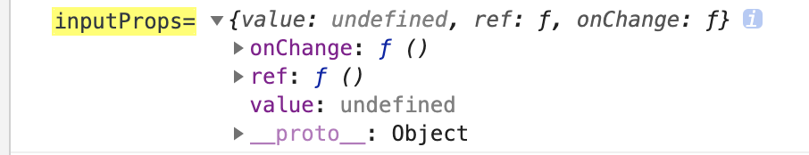

#  Rc-Form源码分析

## Rc-Form文件分析

### createBaseForm.js

#### 这个js主要用于创造基本的 form 组件

他的实现主要利用了react 的 hoc 高级组件方式实现，原理其实就是返回一个匿名函数然后在函数中传递一个子组件进来，然后利用 hoc 高阶组件  把props的form 注入进来给children组件，实现例子,这里用到以前的一些知识点 比如闭包，函数式编程，函数式柯里化。所以下面我们来简单的实现一个props.form 注入 code

```
 // 因为第一层需要传递参数
const createForm = (options) => {
  return (Component) => {
    return class Form extends React.Component {
      getForm() {
        return {
          getFieldsValue: () => {}, // 获取字段值得函数
          getFieldValue: () => {}, // 获取单个值得函数
          getFieldInstance: () => {}, // 获取字段实例
          setFieldsValue: () => {}, // 设置字段值
          setFields: () => {}, // 设置字段 新的值
          setFieldsInitialValue: () => {}, // 设置初始化值的函数
          getFieldDecorator: () => {}, // 用于和表单进行双向绑定，详见下方描述 装饰组件，促进双向绑定的修饰器
          getFieldProps: () => {}, // 创建待验证的表单 设置字段元数据，返回 计算被修饰组件的属性
          getFieldsError: () => {}, //获取一组输入控件的 Error ，如不传入参数，则获取全部组件的 Error
          getFieldError: () => {}, //获取某个输入控件的 Error
          isFieldValidating: () => {}, //判断一个输入控件是否在校验状态
          isFieldsValidating: () => {}, // 判断字段是否在校验中
          isFieldsTouched: () => {}, //判断是否任一输入控件经历过 getFieldDecorator 的值收集时机 options.trigger
          isFieldTouched: () => {}, //判断一个输入控件是否经历过 getFieldDecorator 的值收集时机 options.trigger
          isSubmitting: () => {}, // 是否在 提交状态
          submit: () => {}, // 表单提交函数
          validateFields: () => {}, //验证字段,返回promise
          resetFields: () => {}, // 重置字段
        };
      }
      render() {
        const props = {
          form: this.getForm.call(this),
        };
        return <Component {...props} />;
      }
    };
  };
};

class BaseForm extends React.Component {
  constructor(props) {
    super(props);
  }

  componentDidMount() {
    console.log(this.props);
    debugger;
  }
  render() {
    return (
      <form>
        <input />
        <select>
          <option>1</option>
        </select>
      </form>
    );
  }
}

const Form = createForm({ name: "abc" })(BaseForm);

ReactDOM.render(<Form />, document.getElementById("example"));
```

#### 连接createFieldsStore类的各种方法

* props的form上的方法大多数是调用createFieldsStore类的方法，通过调用createFieldsStore 的各种方法实现控制字段的增删改查。  

## createFieldsStore.js 

* createFieldsStore 可以理解是用于存储字段信息值，包括字段值和校验，错误信息 还有 事件等。可以理解成仓库比如像redux这种。然后这个类会有各种方法包括增删改查字段，校验字段等。

  * 数据格式：

    * 每创建一个form 表单（ 比如 createForm()(RcForm) ） 就会实例化createFieldsStore 一次，同时该createFieldsStore 就会产生一个实例属性fields和一个实例属性fieldsMeta

    * fields 是validateFields 调用回调函数之后，传递给用户的field值，用来记录用户输入值的对象。  数据格式为字段名称作为key， 里面 是对象value值 :  

      ```
       {
        fieldName:{
          value: "1"
        }
       }
      ```

    * fieldsMeta数据 ，该数据作用是为RcForm存储操作记录使用的， 数据格式为字段名称作为key代表的是哪个字段的，然后后面是对象，对象里面存放着字段的事件，校验，初始化值，属性等。


* fieldsMeta 新增，获取和删除方法
  * getFieldMeta  //  获取单个字段的getFieldMeta 对象，如果没有则为 新增 一个空对象
  * setFieldMeta // 设置 fieldsMeta 字段信息  
  * clearField   // 清除Field和Meta字段
* fields的设置和删除字段和获取值方法，
  * setFields // 设置字段 新的值
  * clearField   // 清除Field和Meta字段
  * resetFields // 重置value
  * getValueFromFields // 获取字段的value值 
  * getFieldValuePropValue    // 获取字段的value 值
  * getFieldsValue // 获取字段的值
  * getAllValues // 获取全部字段的值
  * getAllFieldsName //获取全部字段名称
  * getFieldsError // 获取字段错误信息


## createFormField.js

* 该类是为每一个字段创建一个对象用来存储该字段的数据

* 其实该类初始化并没有做什么，可以用一个单列模式去写就可以了。

  

## 创建Form程序流程

* 一开始会调用 createBaseForm，进行 初始化 form表单一些参数比如

```
createBaseForm(options)(Component) 
//options 为整个表单配置的参数
// Component 表单组件 为改组件注入props.form


createBaseForm 组件的 getInitialState 
创建 初始化 fieldsStore 

```

#### getFieldProps 

* 该方法主要是返回 onChange 方法和 value 让组件变成受控组件，促进双向绑定的修饰器。
* 为Meta 类添加一个 MetaFiel 对象
* 

```
 // 获取单个字段的getFieldMeta 对象 这个是字段 信息 和设置 Meta 初始化值作用
var fieldMeta = this.fieldsStore.getFieldMeta(name);
     //获取字段选项参数
        var fieldOption = _extends(
          {
            name: name, // 字段名称
            trigger: DEFAULT_TRIGGER, //onChange 收集子节点的值的时机
            valuePropName: "value", // 字段value
            validate: [], // 验证 空数组
          },
          usersFieldOption //  字段选项参数
        );
         /// ... 省略代码
        
         return inputProps;

```


#### getFieldDecorator  

*  // 用于和表单进行双向绑定，详见下方描述 装饰组件，促进双向绑定的修饰器
* 实际上他主要也是调用getFieldProps 方法
* 通过闭包，hoc高阶组建，利用React.cloneElement 隐形 把props 注入 到组建中
* 以下片段代码

```
    // 用于和表单进行双向绑定，详见下方描述 装饰组件，促进双向绑定的修饰器
      getFieldDecorator: function getFieldDecorator(
        name, // 字段名称
        fieldOption // 字段设置参数
      ) {
        var _this2 = this;
        // 创建待验证的表单 设置字段元数据，返回 计算被修饰组件的属性
        var props = this.getFieldProps(name, fieldOption);
        return function (
          fieldElem // 组件 也可以理解为react 的 vnode 虚拟dom
        ) {
        // .....
        
           return React.cloneElement(
            fieldElem, //原来的vnode
            // props 属性
            _extends(
              {},
              props, // 用户传进来的 props 属性
              // 获取value 属性值
              _this2.fieldsStore.getFieldValuePropValue(fieldMeta)
            )
          );
        
        .....
        
```


